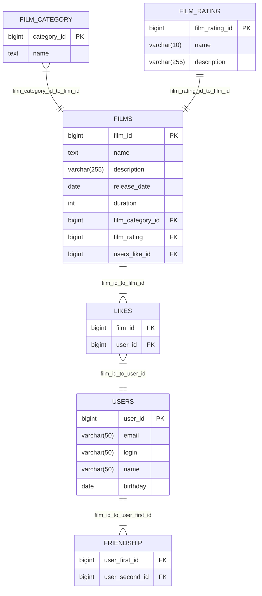

# java-filmorate
Template repository for Filmorate project.

## ER-Диаграмма

The diagram shows the relationships between the SQL tables in the application
### Command SQL FILMS
#### findAll: 
```sql
SELECT * FROM FILMS
```
#### getByID
```sql
SELECT * FROM FILMS WHERE film_id=
```
#### getByID
```sql
SELECT * FROM FILMS WHERE film_id=
```
#### getPopularFilmTo10
```sqlite-psql
SELECT name
FROM films
WHERE film_id IN (SELECT film_id
                  FROM likes
                  GROUP BY film_id
                  ORDER BY COUNT(user_id) desc
                   LIMIT 10);
```

### Command SQL USERS
#### findAll:
```sql
SELECT * FROM USERS
```
#### getByID
```sql
SELECT * FROM USERS WHERE film_id=
```